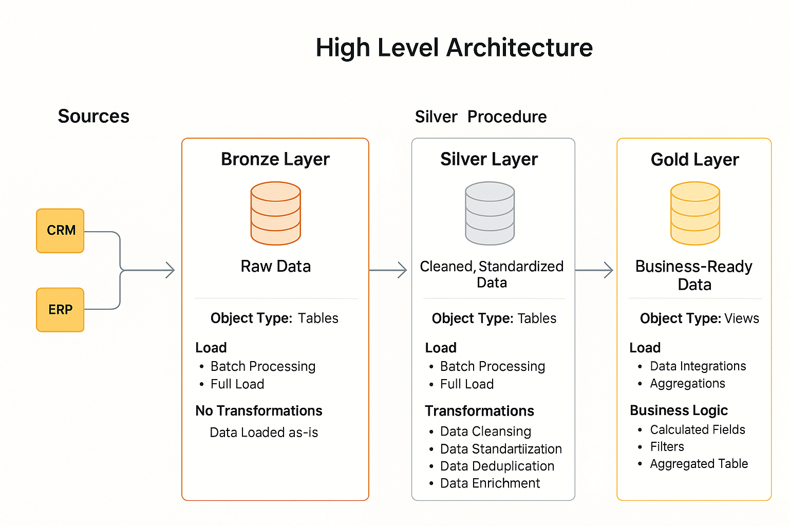
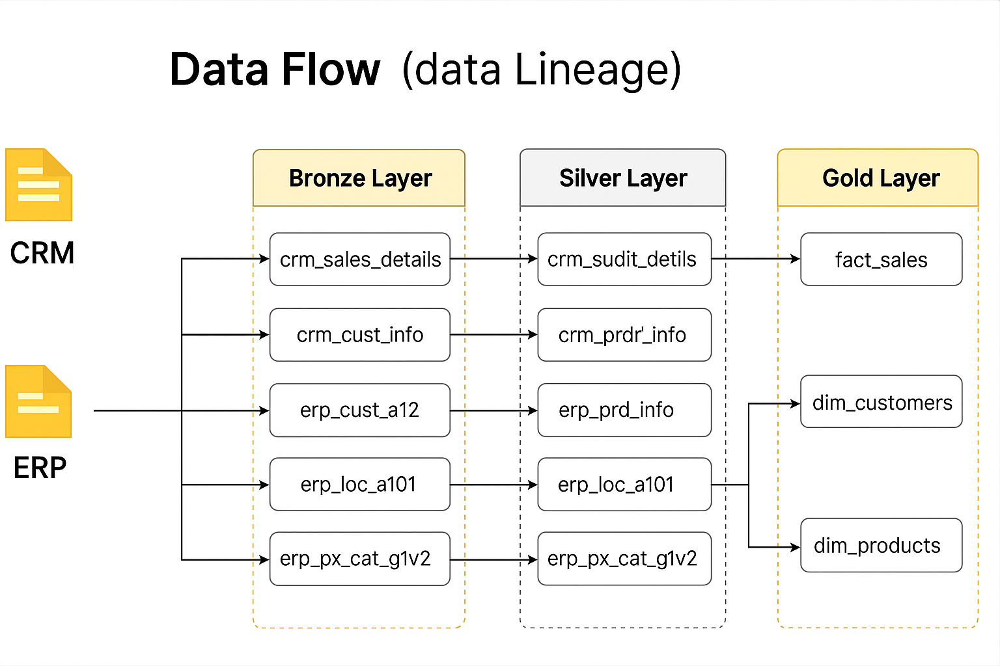
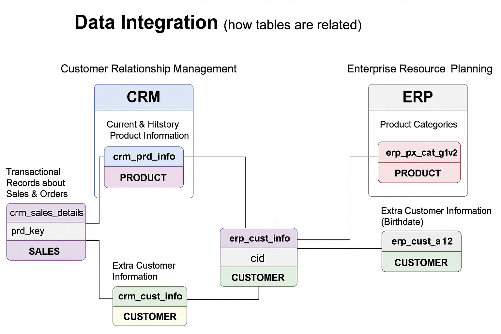

# 📦 SQL Data Warehouse Project

## 📑 Table of Contents

1. [Overview](#overview)  
2. [Repository Structure](#repository-structure)  
3. [High-Level Architecture](#high-level-architecture)  
   - [Bronze Layer (Raw Zone)](#bronze-layer-raw-zone)  
   - [Silver Layer (Cleansed Zone)](#silver-layer-cleansed-zone)  
   - [Gold Layer (Business Zone)](#gold-layer-business-zone)  
4. [Data Flow (Lineage)](#data-flow-lineage)  
5. [Data Integration (Table Relationships)](#data-integration-table-relationships)  
6. [Setup Instructions](#setup-instructions)  
   - [Requirements](#requirements)  
   - [Setup Steps](#setup-steps)  
7. [Project Learnings](#project-learnings)  
8. [Contributing](#contributing)  
9. [License](#license)  
10. [Contact](#contact)  

---

## 🧠 Overview

This project implements a full-featured **SQL-based Data Warehouse** using **PostgreSQL**, based on the **Medallion Architecture** (Bronze, Silver, and Gold layers). It demonstrates end-to-end ETL processes involving ERP and CRM data sources, with focus on:

- Schema standardization  
- Data transformation logic  
- Layered warehousing  
- Business-readiness of data  

---

## 🗂️ Repository Structure

```
sql-datawarehouse/
├── datasets/                   
│   ├── source_erp/             # ERP raw CSV files
│   │   ├── customers.csv       
│   │   └── products.csv        
│   └── source_crm/             # CRM raw CSV files
│       ├── sales_details.csv  
│       └── customer_info.csv  
├── docs/                       
│   ├── high_level_architechture.png  
│   ├── data_flow.png           
│   ├── data_integration.png    
│   └── erd.png                 
├── scripts/                    
│   ├── 01_create_schemas.sql   # Schema creation scripts
│   ├── 02_create_tables.sql    # Table definitions for Bronze/Silver/Gold
│   ├── 03_load_data.py         # Python load script using psycopg2
│   ├── 04_transformations.sql  # Silver & Gold transformation logic
│   └── 05_data_quality_checks.sql  # Data validation SQL
├── tests/                      
│   ├── quality_check_silver.sql
│   └── quality_check_gold.sql  
├── run_setup.sh                # Automates the full pipeline
└── README.md                   # Project documentation (this file)
```

> **Note:** Each directory is organized by pipeline stage:
> - `datasets/`: Source files  
> - `docs/`: Diagrams and ERDs  
> - `scripts/`: ETL logic  
> - `tests/`: Validation queries  

---

## 🧱 High-Level Architecture

The warehouse is built on the **Medallion Architecture**, which organizes data into three progressive layers:



### 🔸 Bronze Layer (Raw Zone)
- **Purpose**: Store raw ingested data without transformation.  
- **Source**: Direct load from CSV files (ERP, CRM).  
- **Objects**: Tables (`erp_cust_a12`, `crm_sales_details`, etc.)  
- **Load Strategy**: Batch/full load  
- **Why Needed**: Preserves data lineage, reproducibility.

### ⚪ Silver Layer (Cleansed Zone)
- **Purpose**: Normalize, clean, standardize data.  
- **Transformations**:
  - Data type casting  
  - Missing value treatment  
  - Joins across ERP & CRM  
- **Objects**: Refined tables (`erp_prd_info`, `crm_prdr_info`, etc.)  
- **Why Needed**: Business-safe layer for analytics and dashboards.

### 🟡 Gold Layer (Business Zone)
- **Purpose**: Serve ready-to-query insights.  
- **Objects**: Aggregated views like `fact_sales`, `dim_products`, `dim_customers`.  
- **Business Logic**:
  - Calculated KPIs  
  - Summary views  
- **Why Needed**: Enables seamless BI integration.

---

## 🔄 Data Flow (Lineage)

This diagram outlines the **data lineage**, showing how raw data evolves through each layer:



- **Bronze Layer**: Stores untouched raw tables from CRM & ERP.  
- **Silver Layer**: Cleans data, resolves duplicates, builds consistent structure.  
- **Gold Layer**: Aggregates and exposes dimensional and fact tables for analysis.

📌 For example:
- `crm_sales_details` → `crm_sudit_detils` → `fact_sales`  
- `erp_cust_a12` + `crm_cust_info` → `dim_customers`

**Why this matters**:
- Clear traceability from source to insights  
- Ensures auditability  
- Allows isolating errors to a layer  

---

## 🔗 Data Integration (Table Relationships)



This diagram depicts how data from different systems is **integrated**:

- **CRM Tables** (e.g., `crm_prd_info`, `crm_sales_details`) hold transactional and product data.  
- **ERP Tables** (e.g., `erp_cust_a12`, `erp_px_cat_g1v2`) provide supplementary metadata.

🔗 **Joins** are defined via shared keys like `cid` and `prd_key` to unify these sources.

📌 Example:
- Customer info is unified by combining `crm_cust_info` and `erp_cust_a12`.  
- Product info is built by linking `crm_prd_info` with `erp_px_cat_g1v2`.

**Why this matters**:
- Business entities (customer/product) often span systems.  
- Integration provides a 360-degree view of operations.

---

## ⚙️ Setup Instructions

### 🔧 Requirements

- PostgreSQL 14+  
- Python 3.9+  
- Required packages:

```bash
pip install psycopg2 pandas
```

### 🛠 Setup Steps

1. **Clone the Repository**

```bash
git clone https://github.com/ASR373/sql-datawarehouse.git
cd sql-datawarehouse
```

2. **Configure Connection**

Edit `scripts/03_load_data.py` with your PostgreSQL credentials.

3. **Run the Setup Pipeline**

```bash
bash run_setup.sh
```

This will:
- Create schemas: `bronze`, `silver`, `gold`  
- Create all necessary tables  
- Load raw data into the Bronze layer  
- Run transformation SQL for Silver & Gold layers  

---

## 💡 Project Learnings

- Realistic simulation of a data warehouse for CRM + ERP  
- Production-quality layer separation (Bronze/Silver/Gold)  
- Automated setup and testing flow  
- Illustrated architecture and table lineage for documentation clarity  

---

## 📄 License

This project is licensed under the [MIT License](LICENSE).

---
